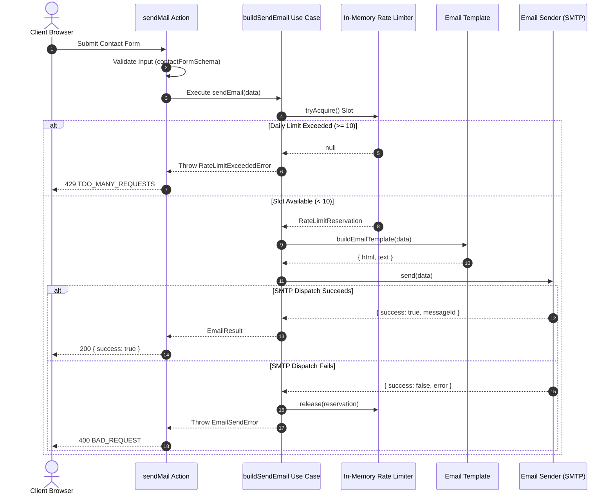

# Mail Processing & Rate Limiting Flow

This document details how contact form submissions are validated, rate limited, and dispatched as emails.

## Sequence Diagram

## Step-by-Step Flow Explanation

1. **Client Submission & Input Validation**:
   - The user submits the contact form.
   - Astro validates the form input using `contactFormSchema` ([src/server/infrastructure/validation/contact-form-validation.ts](../src/server/infrastructure/validation/contact-form-validation.ts)).
   - Honeypot validation ensures the `website` field is empty.

2. **Rate Limiting Check (`tryAcquire`)**:
   - The `buildSendEmail` use case calls `rateLimiter.tryAcquire()`.
   - The in-memory rate limiter tracks sent emails per Swiss calendar day (`Europe/Zurich`).
   - Up to **10 emails** per day are permitted.
   - If 10 slots are already used, a `RateLimitExceededError` is thrown, which maps to `TOO_MANY_REQUESTS` (HTTP 429).

3. **Template Formatting & Sanitization**:
   - The message content is passed to `buildEmailTemplate`.
   - Input strings are HTML-escaped (`<`, `>`, `&`, `"`, `'`) to prevent XSS/HTML injection inside HTML email clients.

4. **Email Dispatch**:
   - Depending on the environment (`import.meta.env.DEV`), `composition.ts` selects either:
     - **Development**: `EtherealEmailSender` (creates a mock Ethereal SMTP account and logs a preview URL).
     - **Production**: `NodemailerEmailSender` (sends email via Infomaniak SMTP configured with `astro:env/server`).

5. **Error Handling & Slot Release**:
   - If SMTP dispatch fails, `rateLimiter.release(reservation)` is called to refund the daily slot.
   - `handleActionError` catches errors and returns structured Astro `ActionError` responses.
