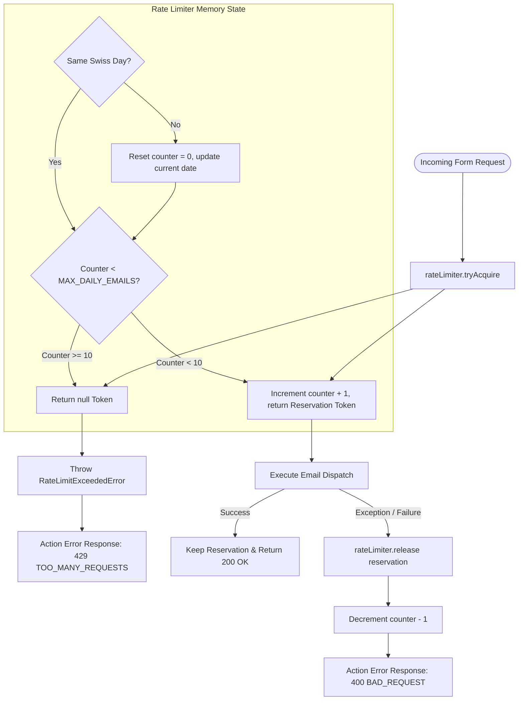

# Rate Limiting Architecture & Process

This document describes the rate limiting design, architectural choices, and execution flow implemented for contact form submissions.

## Architectural Rationale: Why In-Memory?

The rate limiting mechanism is built using an **in-memory strategy** rather than an external database or distributed store (such as Redis).

### Decision Drivers & Context

1. **Single-Instance Deployment (VPS)**:
   - The application is deployed in standalone Node.js mode on a single Virtual Private Server (VPS) behind a reverse proxy.
   - Without a multi-node cluster or horizontal auto-scaling, process-local memory is shared across all incoming HTTP requests handled by the Node.js server.

2. **Simplicity & Zero Infrastructure Dependencies**:
   - Eliminates the need to provision, maintain, and secure an external caching database like Redis.
   - Keeps runtime latency extremely low (sub-millisecond memory access).

3. **Acceptable Edge Case Trade-offs**:
   - **Process Restarts**: Restarting the Node.js process resets the in-memory counter. For a personal portfolio application, a temporary counter reset during deployment is an acceptable trade-off compared to the operational overhead of a database.
   - **Soft Boundary**: The primary goal is spam mitigation and budget protection against runaway SMTP loops rather than strict financial transactional accounting.

---

## Rate Limiting Workflow & State Machine

---

## Detailed Mechanism & Implementation Features

1. **Swiss Calendar Day Reset (`Europe/Zurich`)**:
   - Instead of a rolling 24-hour window, the rate limiter tracks daily capacity based on the **Europe/Zurich** timezone calendar day (`YYYY-MM-DD`).
   - Automatically resets the counter to 0 on the first request of a new calendar day in Switzerland.

2. **Atomic Reservation & Refund Pattern**:
   - **Acquisition**: `tryAcquire()` reserves a slot _before_ triggering the asynchronous SMTP network call to prevent race conditions during concurrent requests.
   - **Automatic Refund (`release`)**: If the downstream email transport encounters an error or network timeout, the application layer catches the exception and releases the token, decrementing the counter so valid users are not penalized for failed delivery attempts.

3. **Clean Architecture Kapselung**:
   - **Application Layer Contract (`RateLimiter`)**: Defines abstract methods (`tryAcquire`, `release`, `getStatus`).
   - **Infrastructure Layer Implementation (`createInMemoryRateLimiter`)**: Implements the memory counter and timezone logic.
   - **Composition Root**: Instantiates the rate limiter as a process-level singleton and injects it into the email use case.
