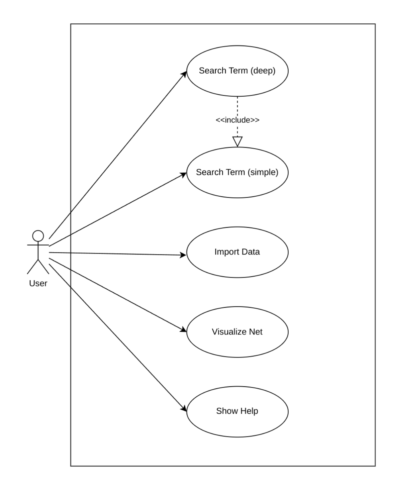
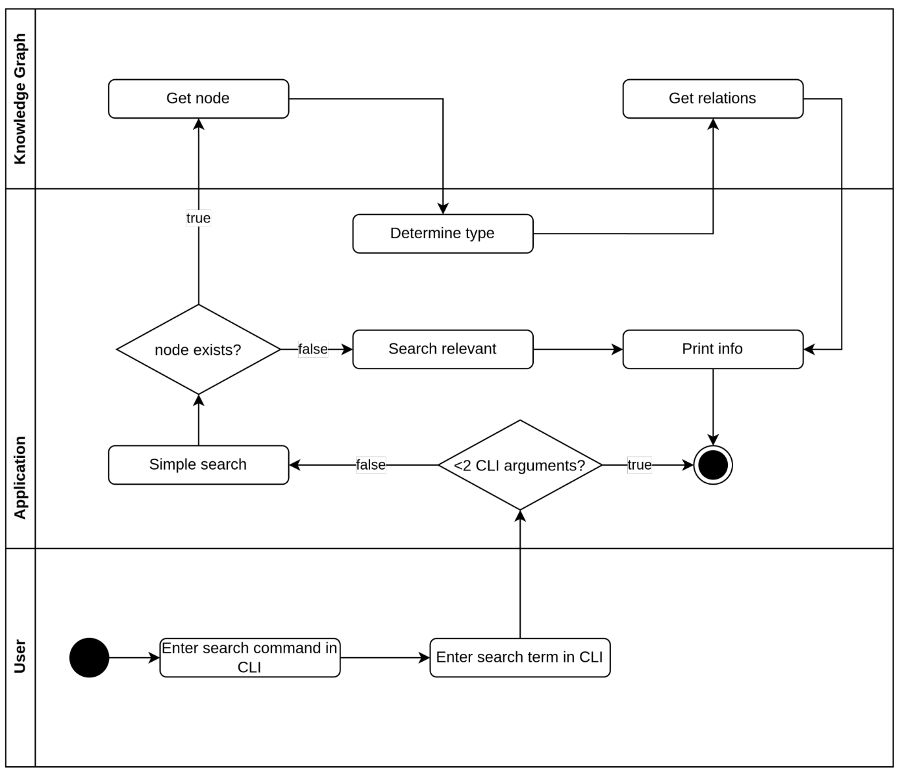
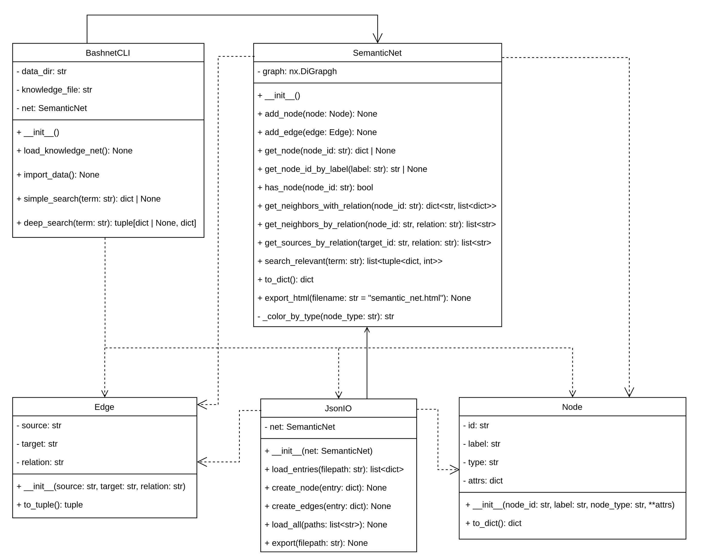

## Projekt in Kürze

Dieses Projekt zeigt die Entwicklung eines prototypischen Wissenssystems auf Basis semantischer Netzwerke. Ziel war es, eine strukturierte und durchsuchbare Datenbasis zu schaffen, die Konzepte miteinander verknüpft und so einen nachhaltigen Umgang mit Wissen ermöglicht. Der Ansatz orientiert sich an anerkannten Standards für Wissensmanagement und Qualitätssicherung.  

Der Prototyp implementiert eine rekursiv durchsuchbare Datenstruktur, die zunächst baumartig aufgebaut und anschliessend zu einem Netzwerkmodell erweitert wurde. Beziehungen zwischen den Knoten werden typisiert gespeichert, sodass vielfältige Abfragen möglich sind.  

Das Projekt verbindet technische Umsetzung mit praktischem Nutzen: Es bietet ein lernförderliches Werkzeug zur Aufbereitung von Kommandozeilenbefehlen und Scripting-Konzepten, unterstützt in der Prüfungsvorbereitung sowie im beruflichen Alltag und fördert den kompetenten Umgang mit datengetriebenen Methoden.  

Als Erweiterungen wurden eine grafische Visualisierung und zwei unterschiedliche Suchmodi (einfache und vertiefte Suche) konzipiert, um die Einsatzmöglichkeiten des Systems zu demonstrieren.  

## Ausgangslage und Kontext

Die Grundlage für das Projekt bildet eine Aufgabenstellung aus dem Bereich Software Engineering in meinem HF-Studium.  
Im Zentrum steht die Entwicklung einer Wissensdatenbank auf Basis eines semantischen Netzes.  

Die Herausforderung hebt die zunehmende Bedeutung strukturierter Wissensspeicherung in Unternehmen hervor und verweist auf Anforderungen einschlägiger Normen (z. B. ISO-9001) zur systematischen Dokumentation und Nutzung von Wissen.  

Ziel war es, innerhalb eines begrenzten Zeitrahmens einen funktionalen Prototypen zu entwickeln, der grundlegende Mechanismen semantischer Wissensvernetzung technisch umsetzt. Dazu sollte zunächst eine rekursiv durchsuchbare Datenstruktur – in Form eines Baums – aufgebaut und später auf ein Netzwerkmodell erweitert werden. Die Beziehungen zwischen den Konzepten sollten typisiert und in den Knoten gespeichert werden.  

Als optionale Erweiterungen wurden eine graphische Darstellung sowie zwei Suchmodi (einfache und vertiefte Suche) vorgesehen.


## Motivation

Die Motivation für das Projekt ergibt sich aus der Relevanz für die Bereiche Linux, IT-Betrieb und Monitoring, in dem fundierte Kenntnisse in der Kommandozeilenbedienung, im Scripting und in der strukturierten Wissensverarbeitung erforderlich sind.  

Ein zentrales Ziel war die Konzeption eines lernförderlichen Werkzeugs, das systematisch aufgebaute Informationen zu Kommandozeilenbefehlen und verwandten Konzepten bereitstellt. Dadurch soll es sowohl in der Prüfungsvorbereitung als auch im beruflichen Alltag als Unterstützung dienen.  

Darüber hinaus bot die Aufgabe die Gelegenheit, sich vertiefter mit semantischen Strukturen, datengetriebenen Ansätzen und rekursiven Informationszugängen auseinanderzusetzen.

## Analyse und Konzeption

### Use Case Analyse
Die funktionalen Anforderungen der Applikation wurden in Form eines Use Case Diagramms modelliert. Die zentrale Interaktion erfolgt über ein Kommandozeileninterface (CLI), über welches die
Benutzerin bzw. der Benutzer semantisch gespeichertes Wissen gezielt durchsuchen, importieren
und exportieren kann.



Im Folgenden werden die fünf zentralen Anwendungsfälle der CLI-basierten Lernapplikation beschrieben. Sie decken die wesentlichen Interaktionen zwischen Benutzer und System ab und bilden die
Grundlage für die Funktionalität der Anwendung:
- UC-01 – Search Term (simple): Führt eine direkte, exakte Suche nach einem Begriff im
semantischen Netz durch.
- UC-02 – Search Term (deep): Erweitert die Suche durch Traversierung semantisch verknüpfter
Knoten.
- UC-03 – Import Data: Lädt strukturierte Wissensdaten aus JSON-Dateien in das semantische
Netz.
- UC-04 – Visualize Net: Stellt das semantische Netzwerk grafisch dar, um Zusammenhänge
sichtbar zu machen.
- UC-05 – Show Help: Zeigt alle verfügbaren CLI-Befehle samt Parametern als Übersicht für
den Benutzer an.
Nachfolgend wird jeder Use Case detailiert tabellarisch beschrieben.

| **Use Case Nr.**           | UC-01                                                                                                                                                                                                                                                                                                     |
| -------------------------- | --------------------------------------------------------------------------------------------------------------------------------------------------------------------------------------------------------------------------------------------------------------------------------------------------------- |
| **Name**                   | Search Term (simple)                                                                                                                                                                                                                                                                                      |
| **Akteur**                 | CLI-Benutzer (User)                                                                                                                                                                                                                                                                                       |
| **Vorausbedingungen**      | - Das semantische Netz wurde zuvor erfolgreich importiert.<br>- Die Datei `knowledge_net.json` ist im erwarteten Verzeichnis vorhanden.<br>- Der gesuchte Begriff befindet sich im Netzwerk (für Positivtests).                                                                                           |
| **Beschreibung**           | Der Benutzer möchte einen konkreten Begriff (z. B. einen Bash-Befehl) im semantischen Netz suchen. Das System soll exakt diesen Begriffsknoten finden und die dazugehörigen Informationen ausgeben. Dies umfasst Label, Typ, Beschreibung, Kategorie, Tags, Beispiele und Links.                          |
| **Ablauf (Hauptszenario)** | 1. Der Benutzer gibt den Befehl `search <term> --simple` ein.<br>2. Das System prüft, ob ein Knoten mit dem exakten Label existiert.<br>3. Ist der Knoten vorhanden, wird er mit allen zugehörigen Informationen ausgegeben.                                                                              |
| **Alternativabläufe**      | **A1: Begriff nicht gefunden**<br>a1.1 Das System gibt eine strukturierte Fehlermeldung aus.                                                                                                                                                                                                              |
| **Akzeptanzkriterien**     | - Der Begriff wird exakt im Netzwerk gefunden.<br>- Label, Typ, Beschreibung, Kategorie, Tags, Beispiele und Links werden ausgegeben.<br>- Bei unbekannten Begriffen erfolgt eine klare Fehlermeldung.                                                                                                    |
| **Testmethode**            | Für die in diesem Use Case beschriebene Funktionalität werden sinnvolle Unit-Tests mit `pytest` erstellt, um die zugrunde liegende Logik automatisiert zu prüfen. Die Ausgabe auf der Kommandozeile wird ergänzend manuell überprüft, um Formatierung, Inhalt und Verständlichkeit visuell zu validieren. |

| **Use Case Nr.**           | UC-02                                                                                                                                                                                                                                                                                                                                                                                                                                                                           |
| -------------------------- | ------------------------------------------------------------------------------------------------------------------------------------------------------------------------------------------------------------------------------------------------------------------------------------------------------------------------------------------------------------------------------------------------------------------------------------------------------------------------------- |
| **Name**                   | Search Term (deep)                                                                                                                                                                                                                                                                                                                                                                                                                                                              |
| **Akteur**                 | CLI-Benutzer (User)                                                                                                                                                                                                                                                                                                                                                                                                                                                             |
| **Vorausbedingungen**      | - Das semantische Netz wurde erfolgreich importiert.<br>- Die Datei `knowledge_net.json` ist vollständig geladen.                                                                                                                                                                                                                                                                                                                                                               |
| **Beschreibung**           | Der Benutzer führt eine vertiefte Suche durch, bei der neben dem gesuchten Begriff auch semantisch verknüpfte Knoten über typisierte Relationen berücksichtigt werden. Abhängig vom Knotentyp (z. B. `command`, `option`, `concept`, `scripting`) wird der Kontext unterschiedlich aufgebaut. Die Ergebnisse werden strukturiert mit dem Zielknoten und den zugehörigen Kontextdaten ausgegeben.                                                                                |
| **Ablauf (Hauptszenario)** | 1. Der Benutzer gibt den Befehl `search <term>` ein (ohne `--simple`).<br>2. Das System sucht den exakten Knoten per UC-01.<br>3. Bei Erfolg wird der Knotentyp geprüft und kontextabhängig verarbeitet:<br>• `command` → zugehörige `options`<br>• `concept` → verknüpfte `commands`, `options`, weitere Konzepte<br>• `scripting` → direkt related Knoten<br>• `option` → referenzierende `commands`<br>4. Das System gibt den Hauptknoten und alle Kontextinformationen aus. |
| **Alternativabläufe**      | **A1: Begriff nicht direkt gefunden**<br>a1.1 Das System findet keinen Knoten mit exakt Match.<br>a1.2 Ein Fallback-Suchmechanismus wird aktiviert.<br>a1.3 Relevante Knoten werden sortiert zurückgegeben.<br><br>**A2: Begriff nicht vorhanden**<br>a2.1 Das System gibt eine strukturierte Fehlermeldung aus.                                                                                                                                                                |
| **Akzeptanzkriterien**     | - Der Begriffsknoten wird korrekt identifiziert.<br>- Der Kontext ist abhängig vom Knotentyp vollständig und korrekt.<br>- Die Relationen sind typisiert und nachvollziehbar.<br>- Bei Nichterfolg liefert der Fallback relevante Alternativen mit Gewichtung.                                                                                                                                                                                                                  |
| **Testmethode**            | Für diesen Use Case werden gezielte Unit-Tests mit `pytest` erstellt. Die Tests prüfen, ob die Tiefensuche für verschiedene Knotentypen korrekt funktioniert und der Kontext jeweils vollständig gebildet wird. Die CLI-Ausgabe wird zusätzlich manuell überprüft, um die Darstellung der Kontextinformationen auf Vollständigkeit, Struktur und Verständlichkeit sicherzustellen.                                                                                              |


| **Use Case Nr.**           | UC-03                                                                                                                                                                                                                                                                                                                                                               |
| -------------------------- | ------------------------------------------------------------------------------------------------------------------------------------------------------------------------------------------------------------------------------------------------------------------------------------------------------------------------------------------------------------------- |
| **Name**                   | Import Data                                                                                                                                                                                                                                                                                                                                                         |
| **Akteur**                 | CLI-Benutzer (User)                                                                                                                                                                                                                                                                                                                                                 |
| **Vorausbedingungen**      | - Strukturierte JSON-Dateien befinden sich im Verzeichnis `data/`.<br>- Die Dateien enthalten gültige Einträge mit eindeutiger ID, Label und Typ.                                                                                                                                                                                                                   |
| **Beschreibung**           | Der Benutzer möchte modulare JSON-Dateien (z. B. `commands.json`, `options.json`) in das semantische Netz importieren. Dabei werden zunächst alle Knoten (Befehle, Optionen, Konzepte etc.) geladen und anschliessend auf Basis von `related`- und `options`-Verweisen typisierte Relationen erzeugt. Das Ergebnis wird zentral in `knowledge_net.json` gespeichert. |
| **Ablauf (Hauptszenario)** | 1. Der Benutzer gibt den Befehl `import` ein.<br>2. Das System lädt die Dateien (`commands.json`, `concepts.json`, `options.json`, `scripting.json`).<br>3. Die Knoten werden angelegt.<br>4. Relationen werden hinzugefügt.<br>5. Das Netzwerk wird in `knowledge_net.json` gespeichert.                                                                           |
| **Alternativabläufe**      | **A1: Ungültige Datei oder fehlerhafte Einträge**<br>a1.1 Das System gibt eine Warnung aus und bricht ab.                                                                                                                                                                                                                                                           |
| **Akzeptanzkriterien**     | - Alle gültigen Knoten werden importiert und gespeichert.<br>- Definierte Relationen (`options`, `related`) werden nur angelegt, wenn die Zielknoten existieren.<br>- Die Datei `knowledge_net.json` enthält ein vollständiges Netzwerk.                                                                                                                            |
| **Testmethode**            | Für diesen Use Case werden Unit-Tests mit `pytest` entwickelt. Dabei wird geprüft, ob Knoten korrekt angelegt und Relationen zuverlässig erzeugt werden. Zusätzlich wird kontrolliert, ob die Exportdatei `knowledge_net.json` vollständig und fehlerfrei erzeugt wird. Eine visuelle Kontrolle ergänzt die Tests.                                                  |

| **Use Case Nr.**           | UC-04                                                                                                                                                                                                                                                                                                                          |
| -------------------------- | ------------------------------------------------------------------------------------------------------------------------------------------------------------------------------------------------------------------------------------------------------------------------------------------------------------------------------ |
| **Name**                   | Visualize Net                                                                                                                                                                                                                                                                                                                  |
| **Akteur**                 | CLI-Benutzer (User)                                                                                                                                                                                                                                                                                                            |
| **Vorausbedingungen**      | - Die Datei `knowledge_net.json` ist vollständig vorhanden.<br>- Das Netzwerk wurde erfolgreich geladen.<br>- Die Umgebung erlaubt eine Browseröffnung oder manuelle Anzeige.                                                                                                                                                  |
| **Beschreibung**           | Der Benutzer möchte das aktuelle semantische Netz grafisch darstellen. Das System erzeugt eine HTML-Visualisierung und öffnet diese im Standardbrowser (sofern möglich). Andernfalls wird eine Meldung zum manuellen Öffnen ausgegeben. Die Darstellung differenziert Knotentypen farblich und erlaubt interaktive Navigation. |
| **Ablauf (Hauptszenario)** | 1. Der Benutzer gibt den Befehl `visualize` ein.<br>2. Das System lädt die Datei `knowledge_net.json`.<br>3. Der Graph wird als HTML-Datei gespeichert.<br>4. Falls möglich, wird diese direkt im Browser geöffnet; andernfalls erfolgt eine Meldung zum manuellen Öffnen.                                                     |
| **Alternativabläufe**      | **A1: Fehler beim Laden der Datei**<br>a1.1 Das System gibt eine strukturierte Fehlermeldung aus.<br><br>**A2: Visualisierung im Docker-Modus**<br>a2.1 Das System erkennt den Docker-Modus.<br>a2.2 Die HTML-Datei wird nicht automatisch geöffnet.<br>a2.3 Ein Hinweis zur manuellen Öffnung wird ausgegeben.                |
| **Akzeptanzkriterien**     | - Der HTML-Graph enthält alle Knoten und Relationen.<br>- Knotentypen sind farblich korrekt kodiert.<br>- Die Datei öffnet fehlerfrei im Browser.<br>- Fehlerzustände werden verständlich behandelt.                                                                                                                           |
| **Testmethode**            | Dieser Use Case wird visuell überprüft. Die HTML-Datei wird im Browser geöffnet und auf Vollständigkeit, Farbgebung, Interaktivität und Lesbarkeit geprüft. Eine automatisierte Prüfung ist nicht vorgesehen.                                                                                                                  |

| **Use Case Nr.**           | UC-05                                                                                                                                                                                                                                                                             |
| -------------------------- | --------------------------------------------------------------------------------------------------------------------------------------------------------------------------------------------------------------------------------------------------------------------------------- |
| **Name**                   | Show Help                                                                                                                                                                                                                                                                         |
| **Akteur**                 | CLI-Benutzer (User)                                                                                                                                                                                                                                                               |
| **Vorausbedingungen**      | - Die Anwendung ist korrekt installiert.<br>- Die CLI wurde über einen gültigen Einstiegspunkt gestartet.                                                                                                                                                                         |
| **Beschreibung**           | Der Benutzer ruft die integrierte Hilfe der Anwendung auf, um sich einen Überblick über Befehle und Optionen zu verschaffen. Die Hilfeausgabe erfolgt in der Kommandozeile und enthält Kurzbeschreibungen zu allen unterstützten Funktionen (Import, Suche, Visualisierung etc.). |
| **Ablauf (Hauptszenario)** | 1. Der Benutzer startet die Anwendung oder gibt `help` ein.<br>2. Das System erkennt die Hilfeanforderung.<br>3. Es wird eine Übersicht aller verfügbaren CLI-Befehle ausgegeben.                                                                                                 |
| **Alternativabläufe**      | **A1: Ungültiger Befehl eingegeben**<br>a1.1 Der Benutzer gibt einen unbekannten oder falsch geschriebenen Befehl ein.<br>a1.2 Das System reagiert mit einem Hinweis auf `help`.                                                                                                  |
| **Akzeptanzkriterien**     | - Die Hilfeausgabe erscheint sofort und vollständig.<br>- Alle Hauptbefehle sind mit Kurzbeschreibung gelistet.<br>- Bei fehlerhaften Eingaben wird entweder die Hilfe oder ein Hinweis ausgegeben.                                                                               |
| **Testmethode**            | Die Funktion wird manuell getestet, indem `help` und fehlerhafte Eingaben geprüft werden. Die Vollständigkeit und Verständlichkeit der Ausgabe werden visuell bewertet. Automatisierte Tests sind optional möglich, aber nicht zwingend erforderlich.                             |

### Aktivitätsdiagramm: Deep Search



Die vertiefte Suche (Deep Search) stellt einen erweiterten Suchmechanismus innerhalb der CLI-Anwendung dar, welcher über eine reine Begriffserkennung hinausgeht und semantische Zusammenhänge im Wissensnetz berücksichtigt. Die Abbildung zeigt den vereinfachten Ablauf dieser Funktionalität in Form eines Aktivitätsdiagramms mit Swimlanes.

Die Suche gliedert sich in mehrere Phasen:

1. Der Benutzer startet die Suche über das CLI, indem ein Suchbegriff **ohne** das Argument `--simple` eingegeben wird.
2. Das System führt eine erste Prüfung durch, ob der Begriff existiert, indem es eine **einfache Suche** aufruft.
3. Wird der Begriff nicht exakt gefunden, greift ein **Fallback-Mechanismus**, der auf Basis einer Relevanzbewertung ähnliche Begriffe vorschlägt.
4. Ist ein passender Knoten gefunden, wird dessen **Typ bestimmt** (z. B. `command`, `concept`, `option`, `scripting`).
5. Abhängig vom Typ werden nun **kontextbezogene Knoten** ermittelt:
   - **command** → verknüpfte `options`  
   - **concept** → zugehörige `commands`, `options` und weitere Konzepte  
   - **scripting** → direkt verwandte Elemente  
   - **option** → alle `commands`, die diese Option verwenden
6. Die gefundenen Informationen (Zielknoten + Kontext) werden formatiert und in der **Kommandozeile** ausgegeben.

Die Swimlanes im Diagramm verdeutlichen die Aufgabenteilung zwischen **Benutzer**, **Applikationslogik** und dem **zugrunde liegenden Wissensnetz (Knowledge Graph)**. Der gesamte Prozess erfolgt ohne weitere Benutzerinteraktion nach Eingabe des Befehls und liefert strukturierte Ausgaben zur Wissensverarbeitung.


## Technische Umsetzung
### Architektur und Struktur
Die Applikation ist in der Programmiersprache **Python (Version 3.12+)** entwickelt und folgt einem modularen, objektorientierten Architekturansatz. Der Aufbau orientiert sich an den **SOLID-Prinzipien**, um eine wartbare und erweiterbare Struktur zu gewährleisten.

- **CLI-Logik** – Verwaltung der Benutzerinteraktion über das Kommandozeileninterface.  
- **Semantisches Netz** – Modellierung des Wissens mittels gerichteter Graphen mit typisierten Knoten und Relationen.  
- **Daten-IO** – Strukturierter Import und Export der Wissensbasis über JSON-Dateien.  
- **Visualisierung** – Erzeugung einer HTML-basierten Netzansicht mit *PyVis*.  

Das folgende Klassendiagramm zeigt die wichtigsten Klassen, deren Beziehungen sowie zentrale Methoden und Attribute.





## Funktionale Implementierung

Die wichtigsten Funktionalitäten wurden in separaten Klassen gekapselt und orientieren sich am **Single-Responsibility-Prinzip**. Die nachfolgende Tabelle beschreibt die zentrale Aufgabenverteilung:

| Klasse / Komponente | Beschreibung |
|---------------------|--------------|
| **BashnetCLI** | Einstiegspunkt der Anwendung. Koordiniert die Interaktion mit dem Benutzer über die Kommandozeile und ruft die geeigneten Methoden zur Datenverarbeitung auf. |
| **SemanticNet** | Verwaltet die Datenstruktur des semantischen Netzwerks. Sie basiert auf einem gerichteten Graphen und bietet Methoden zum Einfügen, Verknüpfen, Abfragen und Exportieren von Knoten und Relationen. |
| **Node & Edge** | Definieren die Strukturelemente des Netzwerks. `Node` enthält Metadaten zu Befehlen, Optionen oder Konzepten. `Edge` stellt typisierte Relationen wie `options` oder `related` dar. |
| **JsonIO** | Verantwortlich für den JSON-Import und -Export. Die Klasse analysiert strukturierte Eingabedateien, erzeugt Knoten und Kanten und speichert das Netzwerk als `knowledge_net.json`. |
| **Suchlogik (simple & deep search)** | Stellt zwei Modi zur Verfügung: eine flache, direkte Suche und eine tiefere, kontextorientierte Analyse inklusive Traversierung relevanter Relationen. |
| **Visualisierung** | Die Methode `export_html()` erzeugt ein dynamisches, interaktives Netzdigramm auf HTML-Basis mit *PyVis*. |

Ein zentraler Einstiegspunkt für die CLI-Funktionalität befindet sich in der Datei `cli.py`.  
Der folgende Auszug zeigt die relevante Steuerlogik für Kommandoausführung und Visualisierung:

```python
import click
import webbrowser
import os
from .cli_core import BashnetCLI
from .utils import print_node_info, print_deep_search_context


def print_help():
    click.secho("Welcome to Bashnet CLI - Your semantic Bash learning tool!\n", fg="cyan")
    click.echo("Available commands:")
    click.echo("    import                      => Load all JSON files and rebuild the semantic net")
    click.echo("    search <term>               => Deep search: context-aware with related information")
    click.echo("    search <term> --simple      => Simple search: exact node only")
    click.echo("    visualize                   => Generate and open an interactive HTML graph")
    click.echo("    help                        => Show this help again")
    click.echo("    exit                        => Exit the application")
    click.echo("Press Ctrl+C anytime to exit.\n")


def handle_search(cli: BashnetCLI, term: str, simple: bool):
    cli.load_knowledge_net()

    if simple:
        node = cli.simple_search(term)
        if node:
            print_node_info(node)
        else:
            click.secho(f"Term '{term}' not found.", fg="red")
    else:
        node, context = cli.deep_search(term)
        if node:
            print_node_info(node)
            print_deep_search_context(node, context)
        elif context.get("fallback"): 
            click.secho(f"Term '{term}' not found directly. Showing relevant matches:\n", fg="yellow")
            from .utils import print_context_fallback
            print_context_fallback(context)
        else:
            click.secho(f"Term '{term}' not found.", fg="red")


def main():
    cli = BashnetCLI()
    print_help()

    while True:
        try:
            user_input = input("bashnet> ").strip()
            if not user_input:
                continue
            if user_input.lower() == "exit":
                break

            args = user_input.split()
            cmd = args[0]

            if cmd == "import":
                cli.import_data()

            elif cmd == "search":
                if len(args) < 2:
                    click.secho("Error: Please provide a term to search.", fg="red")
                    continue
                term = args[1]
                simple = "--simple" in args
                handle_search(cli, term, simple)
            
            elif cmd == "visualize":
                try:
                    cli.load_knowledge_net()
                    html_file = "semantic_net.html"
                    cli.net.export_html(html_file)
                    if os.environ.get("RUNNING_IN_DOCKER") != "1":
                        webbrowser.open(html_file)
                    else:
                        print(f"Open this file manually in your host browser: {html_file}")

                except Exception as e:
                    click.secho(f"Error generating visualization: {e}", fg="red")

            elif cmd == "help":
                print_help()

            else:
                click.secho("Unknown command. Type 'help' to see available commands.", fg="yellow")

        except KeyboardInterrupt:
            click.secho("\nGoodbye!", fg="cyan")
            break
        except Exception as e:
            click.secho(f"Error: {e}", fg="red")

```

## Teststrategie und Qualitätssicherung

Zur Sicherstellung der Funktionalität und Stabilität der Applikation wurde eine mehrstufige Teststrategie entwickelt. Diese umfasst:

- **Unit-Tests**: Überprüfung einzelner Funktionen und Klassenmethoden mit `pytest`.  
- **Testdatenkontrolle**: Validierung typischer Einträge für alle Knotentypen (Befehl, Option, Konzept, Kontrollstruktur).  
- **Kommandozeilenausgabe**: Visuelle Kontrolle der CLI-Ausgabe zur Sicherstellung korrekter Formatierung und Verständlichkeit.  
- **Fehlerbehandlung**: Simulation ungültiger Begriffe und Strukturen zur Prüfung robuster Fehlermeldungen.  

Die automatisierten Tests befinden sich im Verzeichnis `tests/` und werden über `pytest` ausgeführt.  
Insgesamt wurden **12 Unit-Tests** geschrieben und erfolgreich bestanden. Ergänzend erfolgte eine **manuelle Prüfung** der CLI-Reaktionen.

### Testfälle und Ergebnisse
#### UC-01 und UC-02 – Suchfunktion (simple / deep)
**Ziel:** Validierung der exakten Suche (UC-01) und der kontextsensitiven  Tiefensuche (UC-02).
```python
# Auszug aus test search.py – UC-01: Simple Search
def test_simple_search_command():
    cli = DummyCLI([sample_command])
    result = cli.simple_search("cd")
    assert result is not None
    assert result["id"] == "cmd_cd"

```
**Erwartung:** Der Begriff wird exakt erkannt, alle zugehörigen Informationen werden angezeigt. Bei
Begriffen wie "nonexistent" wird None zurückgegeben.

```python
# Auszug aus test search.py – UC-02: Deep Search
def test_deep_search_option():
    cli = DummyCLI([sample_command, sample_option])
    cli.net.add_edge(Edge("cmd_cd", "opt_a", "options"))
    node, context = cli.deep_search("-a")
    assert node is not None
    assert node["id"] == "opt_a"
    assert "commands" in context
```
**Erwartung:** Das System erkennt den Knotentyp und gibt kontextrelevante Relationen zurück. Bei
unbekannten Begriffen wird ein Fallback-Ergebnis geliefert.


#### UC-03 – Import Data


**Ziel:** Überprüfung des Imports von strukturierten JSON-Dateien und der Erzeugung des Netzwerks.

```python
# Auszug aus test import.py – UC-03: Import-Funktion
def test_import_data_creates_knowledge_net(tmp_path):
    
    ...
    ...

  
    cli.import_data()
    assert os.path.exists(cli.knowledge_file)
    assert cli.net.has_node("cmd_echo")
    assert cli.net.has_node("opt_n")
    assert any(
        source == "cmd_echo" and target == "opt_n" and relation == "related"
        for source, target, relation in cli.net.graph.edges.data("relation")
    )

```

**Erwartung:** Die Datei knowledge net.json wird erstellt, alle gültigen Knoten und Relationen korrekt
importiert und gespeichert.

#### Ergänzende CLI-Screenshots

Zur Validierung der visuellen Ausgabe wurden die wichtigsten Funktionen zusätzlich manuell getestet
und als Screenshots dokumentiert. Diese zeigen exemplarisch, wie die Applikation auf typische
Befehle reagiert: 


*CLI-Ausgabe für `search ls --simple` (UC-01)*


*CLI-Ausgabe für `search ls` mit Kontextinformationen (UC-02)*


*Ausschnitt des visualisierten Graphs im Browser durch den Befehl `visualize` (UC-04)*


*Ausgabe des Befehls `help` (UC-05)*


## Resultate und Reflexion

### Zielerreichung
Die wesentlichen Projektziele wurden erreicht. Das semantische Netz konnte erfolgreich mit einer modularen Datenstruktur umgesetzt werden. Über die implementierten Suchmodi (einfache und vertiefte Suche) ist eine gezielte Abfrage möglich, und die Persistierung des Netzes wurde in einer JSON-Datei realisiert. Zusätzlich entstand eine interaktive Visualisierung mit *PyVis*, die das Netz anschaulich darstellt.

### Reflexion und Learnings
Im Projekt konnte wertvolle Erfahrung mit folgenden Themen gesammelt werden:

- **Graph- und Netzwerkanalyse**: Aufbau und Verwaltung gerichteter Graphen mit `networkx`.  
- **Softwarearchitektur**: Anwendung von SOLID-Prinzipien, Kapselung von Funktionalitäten und testbare Modulstruktur.  
- **Teststrategie**: Einsatz von `pytest`, Entwicklung von Unit-Tests und Aufbau von Dummy-Daten zur robusten Fehlerkontrolle.  
- **CLI-Design**: Gestaltung einer nutzerfreundlichen Kommandozeilen-Anwendung mit klar strukturierten Befehlen und verständlicher Ausgabe.  
- **Dokumentation**: Systematische Aufbereitung mit Tabellen, Listings, Screenshots und Diagrammen.  

Diese Aspekte haben nicht nur die technische Umsetzung gefördert, sondern auch meine Kompetenz in den Bereichen **Python-Programmierung, strukturierte Wissensmodellierung und Softwarequalität** gestärkt.

### Weiterentwicklung
Im weiteren Verlauf bieten sich spannende Potenziale:
- **Skalierung**: Einsatz von Indexierung oder erweiterten Suchalgorithmen zur Performanzsteigerung.  
- **Benutzeroberfläche**: Ergänzung einer grafischen Web-Oberfläche (z. B. mit Flask) für eine noch breitere Nutzbarkeit.  
- **Interaktive Erweiterung**: Möglichkeit, neue Knoten direkt über die CLI oder eine WebUI hinzuzufügen.  
- **NLP-Integration**: Einsatz von Natural Language Processing, um Suchanfragen noch natürlicher zu gestalten.  

**Fazit:**  
Das Projekt hat gezeigt, wie aus einer theoretischen Aufgabenstellung ein funktionaler Prototyp mit klarer Architektur und praktischer Anwendbarkeit entstehen kann. Besonders der Umgang mit semantischen Strukturen und die konsequente Testorientierung haben meine Fähigkeiten im Bereich Softwareentwicklung messbar erweitert.
