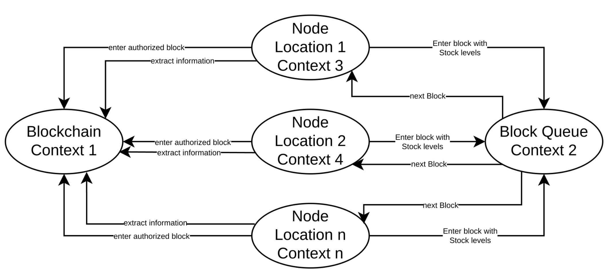
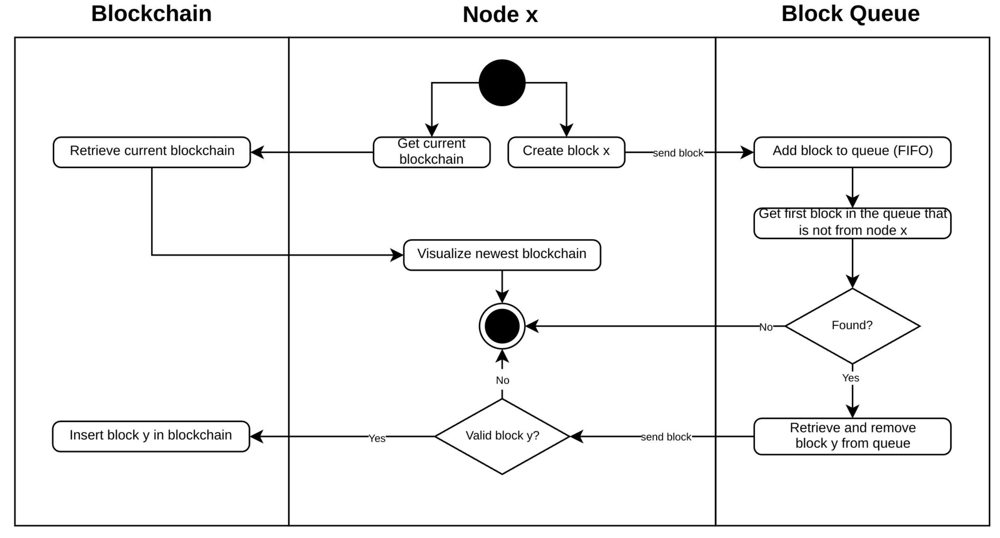
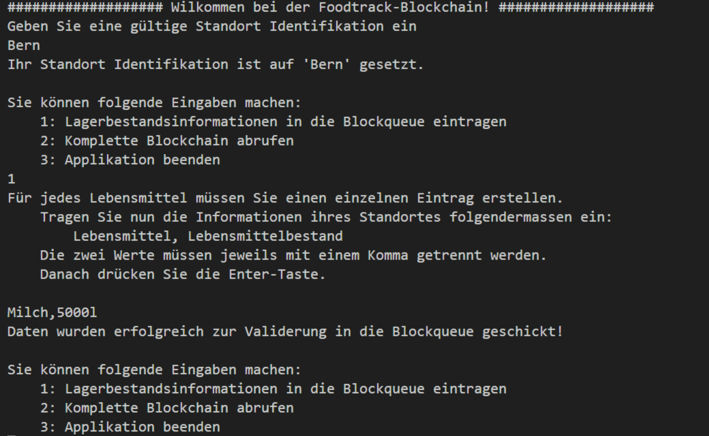
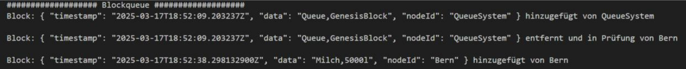
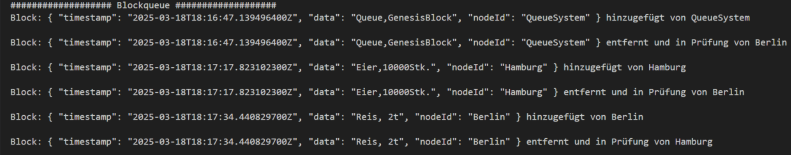
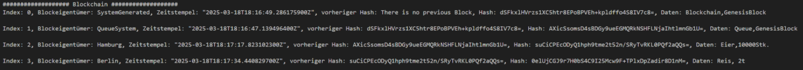
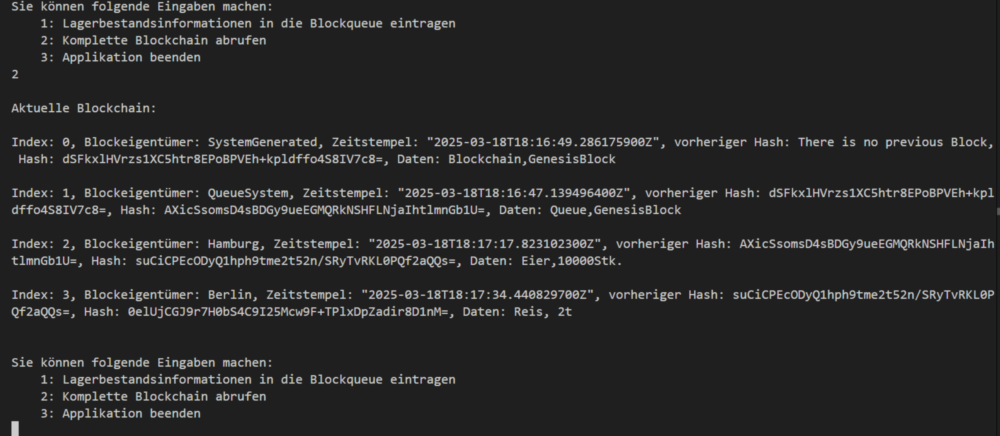

# Projekt in Kürze

Das Projekt „Food Track Blockchain“ befasst sich mit der Entwicklung einer dezentralen Lebensmittel Bestandsverwaltung auf Basis einer vereinfachten Blockchain-Architektur. Ziel ist es, Lagerdaten mehrerer Standorte transparent, nachvollziehbar und fälschungssicher zu speichern. Das System besteht aus drei zentralen Diensten: einem Node-Service, der neue Blöcke erzeugt und validiert, einer Block-Queue, welche die Blöcke in einer FIFO-Reihenfolge verwaltet, sowie einer Blockchain, die gültige Blöcke speichert und miteinander verknüpft. Jeder Standort agiert als eigenständige Node, die fremde Blöcke überprüft, während eigene Blöcke nicht selbst validiert werden dürfen. Die Kommunikation zwischen den Komponenten erfolgt über gRPC-Schnittstellen, die in einer gemeinsamen Bibliothek definiert sind. Das Projekt demonstriert prototypisch, wie sich durch eine schlanke, verteilte Architektur Transparenz und Datenintegrität in vernetzten Systemen gewährleisten lassen.

# Ausgangslage

Das Projekt entstand im Rahmen der Vertiefung „Objektorientierte Programmierung“ in meinem Studium. Ziel war die Entwicklung eines verteilten Systems, das auf einer vereinfachten Blockchain-Architektur basiert. Die Aufgabenstellung sah vor, ein System zu entwerfen, das mehrere autonome Knoten (Nodes) miteinander vernetzt, welche Bestandsdaten in Form von Blöcken erzeugen und austauschen.

Jeder Knoten kann selbstständig neue Blöcke erzeugen, die Informationen wie Art und Menge von Produkten enthalten. Diese Blöcke werden in einer zentralen FIFO-Warteschlange (First In, First Out) zwischengespeichert. Von dort aus werden sie von anderen Knoten geprüft, validiert und schliesslich dauerhaft in eine Blockchain übernommen – vergleichbar mit einem vereinfachten Mining-Prozess.

Die Blockchain wird als lineare Kette von Blöcken realisiert und kann von allen Knoten abgefragt werden, um aktuelle Bestandsdaten einzusehen. Durch diese Struktur entsteht ein transparentes, nachvollziehbares und fälschungssicheres System zur Verwaltung von Lagerbeständen über mehrere Standorte hinweg.


# Architektur und Struktur
## Context Map
Die Context Map beschreibt die Architektur des verteilten Blockchain-Systems zur Verwaltung
der Lagerbestände. Die Context Map stellt die wesentlichen Komponenten des Systems sowie deren Interaktionen dar.
Das System ist in drei zentrale Kontexte unterteilt:
- Blockchain Context: Verantwortlich für die Speicherung der validierten Blöcke.
- Block Queue Context: Verwaltet eine Warteschlange nach dem FIFO-Prinzip (First In, First Out) für neu eingehende Blöcke.
- Node Contexts: Repräsentieren die einzelnen Standorte, die Blöcke generieren, validieren und in die Blockchain überführen.

Die einzelnen Nodes (Knoten) erstellen Blöcke mit den relevanten Lagerbestandsinformationen und senden diese an die Block Queue. Die Warteschlange verarbeitet die eingehenden
Blöcke in der Reihenfolge ihres Eingangs und leitet sie zur Validierung an andere Nodes weiter.
Nach einer erfolgreichen Validierung werden die Blöcke in die Blockchain eingetragen. Zusätzlich haben die Nodes die Möglichkeit, die gesamte Blockchain abzufragen und sich den aktuellen Stand der Lagerbestände anzeigen zu lassen.




*Context Map*

## Service Struktur
Die Service-Struktur besteht aus dem Node Service zur Blockerstellung und -validierung, dem
Block Queue Service zur Verwaltung der Warteschlange und dem Blockchain Service zur Speicherung validierter Blöcke. Diese Architektur gewährleistet eine effiziente Verwaltung der Lagerbestände. Zusätzlich enthält die DLL die Block-Klasse sowie die Proto-Dateien, die von den
jeweiligen Services genutzt werden.

### Node Service (Konsolen Anwendung)

Der Node Service ist für die Erstellung und Validierung von Blöcken innerhalb des verteilten Blockchain-Systems verantwortlich. Jeder Node generiert neue Blöcke mit Lagerbestandsinformationen und überträgt diese in die Block Queue. Dabei stellt jeder Node
sicher, dass die von anderen Nodes eingetragenen Blöcke überprüft und validiert werden, bevor sie endgültig in die Blockchain übernommen werden.
Der Prozess erfolgt in folgenden Schritten:

1. Ein Node erstellt einen neuen Block mit Lagerbestandsinformationen und übermittelt
diesen an den Block Queue Service.
2. In regelmässigen Zeitabständen ruft der Node Blöcke aus der Warteschlange ab, die
nicht von ihm selbst stammen. Dazu stellt er Anfragen an den Block Queue Service.
3. Der Node validiert den Dateninhalt nach festgelegten Prüfregeln.
4. Nach erfolgreicher Validierung wird der Block an den Blockchain Service weitergeleitet,
wo er endgültig in die Blockchain eingetragen und mit einem Hash-Wert versehen wird.
5. Auf Anfrage kann der Node jederzeit die aktuelle Version der Blockchain abrufen.
Da ein Node seine eigenen Blöcke nicht selbst validieren kann, erfolgt die Überprüfung ausschliesslich durch andere Nodes. Dies gewährleistet eine dezentrale Validierung und reduziert
das Risiko einer Manipulation innerhalb des Systems.

### Block Queue Service (gRPC Service)
Der Block Queue Service dient als Zwischenspeicher für neu erzeugte Blöcke und arbeitet
nach dem FIFO-Prinzip, sodass die ältesten Blöcke zuerst verarbeitet werden.
Der Ablauf gestaltet sich wie folgt:
1. Ein Node übergibt einen Block an den Block Queue Service.
2. Der Block Queue Service speichert den Block entsprechend dem FIFO-Prinzip, indem
er ihn am Ende der Warteschlange anfügt.
3. Auf Anfrage eines Nodes extrahiert der Block Queue Service den ersten Block aus der
Warteschlange, sofern dieser nicht vom anfragenden Node stammt.
4. Falls ein Block gefunden wird, wird dieser zur Validierung an den Node zurückgegeben
und aus der Warteschlange entfernt. Andernfalls wird ein leerer Block zurückgegeben.

### Blockchain Service (gRPC Service)
Der Blockchain Service übernimmt die Verwaltung und Speicherung der validierten Blöcke.
Nach der erfolgreichen Prüfung durch einen Node wird der Block hier dauerhaft eingetragen.
Der Ablauf erfolgt in folgenden Schritten:
1. Ein Node übermittelt einen validierten Block an den Blockchain Service.
2. Der Blockchain Service speichert den Block in der linearen Blockchain-Liste und erzeugt dabei die Hash-Werte.
Jeder Node kann jederzeit die aktuelle Blockchain abrufen und visualisieren.

### Shared (Dynamic Link Library)
Die Shared-DLL umfasst das Block-Modell sowie zwei Proto-Dateien: eine für die gRPC-Kommunikation mit der BlockQueue und eine für die Blockchain. Die Block-Klasse weicht leicht
von der ursprünglichen Vorgabe ab, da sie für die gRPC-Serialisierung optimiert wurde. Zudem
wurde die Eigenschaft `NodeId` hinzugefügt, um die Blöcke den jeweiligen Standorten zuzuordnen.

```csharp
// Strukur eines Blocks / teilweise vorgegeben
using System.Security.Cryptography;
using System.Text;
using ProtoBuf;
using Google.Protobuf.WellKnownTypes;

[ProtoContract]
public class Block
{
    [ProtoMember(1)]
    public int Index { get; set; }

    [ProtoMember(2)]
    public Timestamp TimeStamp { get; set; }

    [ProtoMember(3)]
    public string PreviousHash { get; set; }

    [ProtoMember(4)]
    public string Hash { get; set; }

    [ProtoMember(5)]
    public string Data { get; set; }

    [ProtoMember(6)]
    public string NodeId { get; set; }

    public Block(Timestamp timeStamp, string previousHash, string data, string nodeId)
    {
        Index = 0;
        TimeStamp = timeStamp;
        PreviousHash = previousHash;
        Data = data;
        NodeId = nodeId;
        Hash = CalculateHash(); 
    }

    public string CalculateHash()
    {
        return Convert.ToBase64String(SHA256.Create().ComputeHash(Encoding.ASCII.GetBytes(string.Format("{0}-{1}-{2}-{3}",
        TimeStamp,
        PreviousHash ?? "",
        Data,
        NodeId ?? ""
        ))));
    }
}
```

*Klasse "Block"*

```protobuf
syntax = "proto3";

package block_chain.v1;

option csharp_namespace = "ProtoBlockchain.Protos.V1";

import "google/protobuf/timestamp.proto";

//Block definition for chain
message ChainBlockGRPC {
  int32 index = 1;
  google.protobuf.Timestamp timestamp = 2;
  string previous_hash = 3;
  string hash = 4;
  string data = 5;
  string node_id = 6;
}

// For empty requests
message Empty {}

// Acknowledgement
message Acknowledgement {
  bool success = 1;
  string message = 2;
}

//RPCs
service BlockchainService {
  rpc AddBlock(ChainBlockGRPC) returns (Acknowledgement);
  rpc GetBlockchain(Empty) returns (stream ChainBlockGRPC);
}
```
*Proto für Blockchain*

```protobuf
syntax = "proto3";

package block_queue.v1;

option csharp_namespace = "ProtoBlockQueue.Protos.V1";

import "google/protobuf/timestamp.proto";

//Block definition for queue
message QueueBlockGRPC {
  google.protobuf.Timestamp timestamp = 1;
  string data = 2;
  string node_id = 3;
}

//Acknowledgement
message Acknowledgement {
  bool success = 1;
  string message = 2;
}

//Node identification
message NodeId {
  string node_id = 1;
}


//RPCs
service BlockQueueService {
  rpc SendBlock(QueueBlockGRPC) returns (Acknowledgement);
  rpc RequestBlock(NodeId) returns (QueueBlockGRPC);
}

```
*Proto für BlockQueue*

## Aktivitätsdiagramm

Dieses Aktivitätsdiagramm veranschaulicht die grundlegende Funktionsweise des Systems.



# Algorithmen
Nachfolgend werden die verschiedenen Algorithmen in ihrer Grundstruktur beschrieben. Für
detaillierte Informationen ist der Quellcode heranzuziehen.

## Block bilden

Wenn der Nutzer im Menü die Option 1 wählt, kann ein Lagerbestand als Block erfasst werden.
Die eingegebenen Daten werden nicht sofort validiert und können auch `null` sein. Die Validierung erfolgt erst in einem späteren Schritt durch eine andere Node.
Der eingegebene Wert wird ausgelesen und in der Variable `data` gespeichert. Anschliessend
wird der aktuelle Zeitstempel gesetzt. Danach wird ein Objekt der Klasse QueueBlockGRPC
erstellt, das folgende Informationen enthält:
- Timestamp: Der Zeitpunkt der Blockerstellung.
- Input-Daten: Die eingegebenen Lagerbestandsinformationen.
- Node-Identifikation: Die eindeutige Kennung der Node, die den Block erstellt.

Die Node-Identifikation wird zu Beginn der Anwendung vom Nutzer festgelegt. Die Klasse QueueBlockGRPC wird automatisch durch den Protocol Buffers Compiler generiert und in der
zugehörigen .proto-Datei definiert. Die Klasse QueueBlockGRPC wurde bewusst auf die wesentlichen Attribute beschränkt, da Hash-Werte innerhalb der Block Queue nicht erforderlich sind. Die Block Queue dient ausschliesslich als temporärer Zwischenspeicher für neue Blöcke, bevor diese validiert und endgültig in die Blockchain eingetragen werden. Die Generierung von Hash-Werten erfolgt erst im BlockchainService, da dort die endgültige Speicherung und Integritätssicherung der Blöcke stattfindet.

```csharp
...
string? input = Console.ReadLine();
    switch (input)
    {
        case "1":
            {
                ShowInputCreationMessage();
                string? data = Console.ReadLine(); //Data can be null

                //Set Timestamp
                DateTime utcNow = DateTime.UtcNow;
                Timestamp timestamp = Timestamp.FromDateTime(utcNow);

                // Create a new GRPC block with the provided data, data is allowed to be null => will be validated by another node
                QueueBlockGRPC blockGRPC = new()
                {
                    Timestamp = timestamp,
                    Data = data,
                    NodeId = nodeId
                };

                // Initialize the BlockQueueHandler with the service URL
                BlockQueueHandlerService blockQueueHandlerService = new(blockQueueServiceURL);

                // Asynchronously send the block to the BlockQueueService
                await blockQueueHandlerService.SendBlockAsync(blockGRPC);

                Console.WriteLine();
                ShowMenu();
            }
            break;
            ...
            ...
    }
```

*Ausschnitt: NodeService/Program.cs*

### Test
Für den Test wurde die NodeId als Standortidentifikation auf «Bern» gesetzt. Anschliessend
wurde im Menü die Option 1 gewählt, um einen Lagerbestand zu erfassen. Dabei wurde der
Eintrag "Milch, 5000l" als QueueBlockGRPC-Objekt erstellt und an den BlockQueueService gesendet.



*Ausschnitt: Konsolenausgabe von NodeService, Test Blockbildung*

## Block in BlockQueue eintragen
Nach der Erfassung des Lagerbestands wird ein Objekt des BlockQueueHandlerService erstellt, das für die Kommunikation mit dem BlockQueueService zuständig ist. Anschliessend wird der Block an die Block Queue gesendet. 
```csharp
 // Asynchronously send the block to the BlockQueueService
    await blockQueueHandlerService.SendBlockAsync(blockGRPC);
```
*Ausschnitt: NodeService/Program.cs, Block an BlockQueue senden*

Die Klasse BlockQueue (als Singleton registriert) verwaltet die Warteschlange für Blöcke und ermöglicht das Hinzufügen, Entfernen sowie die Auswahl von Blöcken zur Validierung. Der BlockQueue-Liste wird nun über BlockQueueServiceImpl der Block angefügt.

```csharp
// Implementation of the BlockQueueService defined in the gRPC proto file.
public class BlockQueueServiceImpl : BlockQueueService.BlockQueueServiceBase
{

    private readonly BlockQueue _blockQueue;
    public BlockQueueServiceImpl(BlockQueue blockQueue)
    {
        _blockQueue = blockQueue;
    }
    
    
    // Adds a new block to the queue.
    public override Task<Acknowledgement> SendBlock(QueueBlockGRPC requestBlock, ServerCallContext context)
    {
        try
        {   // Add the received block to the queue
            _blockQueue.AddBlock(requestBlock);

            // Return a successful acknowledgment message.
            return Task.FromResult(new Acknowledgement { Success = true, Message = "Block received" });

        }
        catch (Exception ex)
        {
            // If an exception occurs, throw an RpcException with an internal status code and the exception message.
            throw new RpcException(new Status(StatusCode.Internal, $"Interner Serverfehler: {ex.Message}"));
        }
    }
    ...
    ...
}
```

*Ausschnitt: BlockQueueService/Services/BlockQueueServiceImpl.cs, Eintragung des Blocks in die Blockqueue*

### Test
In der Ausgabe des BlockQueueServices ist ersichtlich, dass der in Abbildung gezeigte Block erfolgreich in die BlockQueue eingetragen wurde. Zusätzlich wurde der Genesis-Block automatisch vom System erzeugt und bereits zur Validierung an eine Node (in diesem Fall «Bern») weitergegeben.



*Ausschnitt: : Konsolenausgabe BlockQueueService, Test BlockQueue-Eintrag (3. Zeile)*


## Block auslagern und validieren
Die Auslagerung eines Blocks aus der BlockQueue sowie dessen Validierung erfolgen durch den BlockValidationService. Dieser wird initialisiert und gestartet, sobald der NodeService eine NodeId zugewiesen bekommen hat. Der gesamte Prozess läuft in einem separaten asynchronen Task, wodurch eine kontinuierliche Verarbeitung der Blöcke ermöglicht wird (alle Sekunden).

```csharp
...

//Start continous block validation on seperate Task
BlockValidationService blockValidationService = new(nodeId, blockQueueServiceURL, blockChainServiceURL);
blockValidationService.Start();

...
```
*Ausschnitt: : NodeService/Program.cs, Start des BlockValidationServices*

Die Klasse BlockValidationService übernimmt die Verantwortung für die Auslagerung eines
Blocks aus der BlockQueue, die Validierung der Daten und falls der Block als gültig eingestuft wird, das Übertragen an die Blockchain.

```csharp
...
 public void Start()
    {
        Task.Run(async () =>
        {
            while (true)
            {
                try
                {
                    // Request to the BlockQueueService
                    var requestQueueBlock = await _blockQueueHandlerService.RequestBlockAsync(_nodeId);
                    Debug.WriteLine($"Neue Anfrage für Blockvaliderung von {_nodeId}");
                }
                ...
            }
            ...
        }
        ...
    }
    ...
...
```
*Ausschnitt: NodeService/Services/BlockValidationService.cs, Blockanfrage an Blockqueue*


Zunächst fordert der BlockValidationService über ein Objekt des BlockQueueHandlerService
einen Block aus der BlockQueue an. Dabei wird die aktuelle NodeId übermittelt, um sicherzustellen, dass der Node keinen eigenen Block validiert. Der BlockQueueService gibt daraufhin den ältesten Block zurück, der nicht von der anfragenden Node stammt. Dieses Verfahren gewährleistet die Einhaltung des FIFO-Prinzips, sofern ein gültiger Block verfügbar ist. Nachdem der Block erfolgreich übermittelt wurde, wird er aus der BlockQueue entfernt, um Mehrfachverarbeitung zu vermeiden.
Im BlockValidationService erfolgt nun die Validierung des Blocks. Dabei werden folgende Prüfkriterien angewendet:
- Existenzprüfung: Der Block darf nicht `null` sein.
- Datenprüfung: Der Block muss einen gültigen Dateninhalt enthalten.
- Formatprüfung: Die Lagerbestandsinformationen müssen im korrekten Format vorliegen, d. h., die Werte müssen durch ein Komma getrennt sein.

```csharp
...

private bool IsValidRequestBlock(QueueBlockGRPC block)
    {
        if(block == null)
        {
           Debug.WriteLine($"Antwort war null");
           return false;
        }
        
        if (string.IsNullOrWhiteSpace(block.Data))
        {
            Debug.WriteLine($"Keine Daten im Block {block.Timestamp}!");
            return false;
        }

        var parts = block.Data.Split(',');
        if (parts.Length != 2 || parts.Any(string.IsNullOrWhiteSpace))
        {
            Debug.WriteLine($"Daten im Block {block.Timestamp} sind nicht gültig!");
            return false;
        }

        return true;
    }

...
```
*Ausschnitt: NodeService/Services/BlockValidationService.cs, Validierung eines Blocks*
  
Sollte eine dieser Regeln nicht erfüllt sein, wird der Block als ungültig betrachtet und verworfen.
Ist der Block jedoch valide, wird er zur weiteren Verarbeitung an den BlockchainService übergeben, wo er in die bestehende Blockchain integriert wird. Dieses Verfahren stellt sicher, dass nur korrekte und geprüfte Blöcke in die Blockchain aufgenommen werden, wodurch die Datenintegrität gewahrt bleibt und Manipulationen verhindert
werden.

### Test
Im durchgeführten Test hat der Node «Hamburg» einen Block in die BlockQueue eingetragen.
Dieser Block wurde anschliessend vom Node «Berlin» aus der BlockQueue entnommen, validiert und weiterverarbeitet.
Darüber hinaus hat der Node «Berlin» ebenfalls einen Block in die BlockQueue eingefügt.
Dieser Block wurde wiederum vom Node «Hamburg» ausgelagert, validiert und entsprechend
weiterverarbeitet. Dieses Vorgehen bestätigt die korrekte Funktionsweise der BlockQueue,
insbesondere die Sicherstellung, dass ein Node nicht seine eigenen Blöcke validieren kann.


*Ausschnitt: Konsolenausgabe BlockQueueService, Test der Einlagerung und Auslagerung von Blöcken nach FIFO-Prinzip in der BlockQueue*

## Block in Blockchain einlagern
Nach der erfolgreichen Validierung wird der Block von einem QueueBlockGRPC in einen
ChainBlockGRPC umgewandelt. Dabei werden der Zeitstempel, die Lagerbestandsdaten sowie die NodeId übernommen. Anschliessend wird der Block über den BlockchainHandlerService an den BlockchainService weitergeleitet, wobei der BlockchainHandlerService die Kommunikation zwischen dem BlockchainService und dem NodeService übernimmt.

Im BlockchainService wird der ChainBlockGRPC auf das Block-Modell der Blockchain-Klasse
gemappt. Dabei wird zunächst der letzte Block in der Blockchain abgerufen, um den neuen
Index zu bestimmen. Der Index des neuen Blocks wird um eins erhöht, basierend auf dem zuletzt eingetragenen Block. Zudem wird der Hash des vorherigen Blocks als PreviousHash des neuen Blocks gesetzt, um die Verkettung der Blöcke sicherzustellen.
Nachdem diese Werte bestimmt wurden, wird der Hash des neuen Blocks berechnet. Dies
geschieht auf Grundlage des Zeitstempels, der Lagerbestandsdaten, der NodeId sowie des
Hash-Werts des vorherigen Blocks. Durch diese Berechnung wird sichergestellt, dass jeder Block eine eindeutige Identifikation erhält und eine nachträgliche Manipulation erkannt werden kann.

Nach der Hash-Berechnung wird der Block in die Blockchain-Datenstruktur eingefügt. Eine Konsolenausgabe bestätigt die erfolgreiche Einlagerung. Dieses Verfahren gewährleistet, dass jeder Block korrekt mit seinem Vorgänger verknüpft ist und die Integrität der Blockchain erhalten bleibt.

```csharp
...
// Check whether the received block is valid
if (IsValidRequestBlock(requestQueueBlock))
{
    // Map the Block object from the BlockQueue proto to the Blockchain proto
    var validBlock = new ChainBlockGRPC
    {
        Index = 0, //set in blockchain service
        Timestamp = requestQueueBlock.Timestamp,
        PreviousHash = "placeholder", //set in blockchain service
        Hash = "placeholder", //set in blockchain service
        Data = requestQueueBlock.Data,
        NodeId = requestQueueBlock.NodeId
    };

    // Insert block into blockchain via BlockChainHandler
    var insertBlockInChain = await _blockchainHandlerService.AddBlockAsync(validBlock);
    if (insertBlockInChain.Success)
    {
        Debug.WriteLine($"Blockindex:{validBlock.Index} => {insertBlockInChain.Message}");
    }
    else
    {
        Debug.WriteLine("Fehler beim einfügen des Blocks in Blockchain");
    }
}
...
```
*Ausschnitt: NodeService/Services/BlockValidationService.cs, Mapping des Blocks von QueueBlockGRPC in ChainBlockGRPC*


```csharp
...

 public override Task<Acknowledgement> AddBlock(ChainBlockGRPC request, ServerCallContext context)
    {
        try
        {
            // Create a new block based on the received GRPC-Block
            var newBlock = new Block(
                request.Timestamp,
                request.PreviousHash,
                request.Data,
                request.NodeId
            );

            // Add the new block to the blockchain
            _blockchain.AddBlock(newBlock);

            // Return of a confirmation message
            return Task.FromResult(new Acknowledgement
            {
                Success = true,
                Message = "Block erfolgreich hinzugefügt."
            });
        }

        catch (Exception ex)
        {
            // If an exception occurs, throw an RpcException with an internal status code and the exception message.
            throw new RpcException(new Status(StatusCode.Internal, $"Interner Serverfehler: {ex.Message}"));
        }
    }

...
```
*Ausschnitt: BlockchainService/Services/BlockChainServiceImpl.cs, Mapping von ChainBlockGRPC auf Block-Modell und einfügen in Blockchain*


```csharp
...
  public void AddBlock(Block newBlock)
    {
        var latestBlock = GetLatestBlock();
        newBlock.Index = latestBlock.Index + 1;
        newBlock.PreviousHash = latestBlock.Hash;
        newBlock.Hash = newBlock.CalculateHash();
        _chain.Add(newBlock);
        Console.WriteLine($"Index: {newBlock.Index}, Blockeigentümer: {newBlock.NodeId}, Zeitstempel: {newBlock.TimeStamp}, vorheriger Hash: {newBlock.PreviousHash}, Hash: {newBlock.Hash}, Daten: {newBlock.Data}\n");      
    }
...
```
*Ausschnitt: BlockchainService/Models/Blockchain.cs, Methode zum Einfügen eines Blocks in die Blockchain*

### Test
Der durchgeführte Test bestätigt, dass die Blöcke mit den Indizes 2 und 3, die im Testverfahren gemäss letztem Test aus der BlockQueue entnommen und validiert wurden, erfolgreich in die
Blockchain eingetragen wurden. Dies zeigt, dass die Mechanismen zur Blockvalidierung, Umwandlung und Einlagerung in die Blockchain ordnungsgemäss funktionieren.
Die korrekte Indexierung der Blöcke innerhalb der Blockchain belegt zudem, dass die Verkettung mit den vorherigen Blöcken einwandfrei erfolgt ist. Somit wird sichergestellt, dass die Blockchain die erwartete Konsistenz und Integrität aufweist.



*Ausschnitt: Konsolenausgabe BlockchainService, Test der Blockeinlagerung in die Blockchain*

## Blöcke aus Blockchain auslagern
Wenn der User des NodeServices im Hauptmenü die Option 2 auswählt, wird der vollständige Inhalt der Blockchain abgerufen und ausgegeben. Hierbei wird die Methode `GetBlockchainAsync()` aus der Klasse BlockchainHandlerService aufgerufen, welche eine Verbindung zum BlockchainService herstellt und die gespeicherten Blöcke anfordert.
Nach dem Absenden der Anfrage beginnt der BlockchainService, die vorhandenen Blöcke als
Datenstrom (stream) zu senden. Diese Blöcke werden innerhalb einer Schleife nacheinander
empfangen und in eine Liste gespeichert. Jeder Block wird dabei im ChainBlockGRPC-Format
übermittelt, das die relevanten Blockinformationen wie Index, Zeitstempel, vorherigen Hash,
aktuellen Hash, Daten und die NodeId enthält.
Nachdem die gesamte Blockchain-Liste empfangen wurde, gibt der NodeService die Blöcke
in der Konsole aus. Die Ausgabe erfolgt blockweise, wobei jeder Block mit seinen wichtigsten
Attributen dargestellt wird. Dieses Verfahren stellt sicher, dass der Knoten jederzeit eine vollständige und aktuelle Kopie der Blockchain abrufen kann. Es dient zudem der Verifikation, ob die Blöcke korrekt gespeichert und die Verkettung innerhalb der Blockchain konsistent geblieben ist.

```csharp
...

 case "2":
            {
                BlockchainHandlerService blockchainHandlerService = new(blockChainServiceURL);
                var blockchain = await blockchainHandlerService.GetBlockchainAsync();
                Console.WriteLine("\nAktuelle Blockchain:\n");
                foreach (var block in blockchain)
                {
                    Console.WriteLine($"Index: {block.Index}, Blockeigentümer: {block.NodeId}, Zeitstempel: {block.Timestamp}, vorheriger Hash: {block.PreviousHash}, Hash: {block.Hash}, Daten: {block.Data}\n");   
                }
                Console.WriteLine();
                ShowMenu();
            }
            break;
...
```

*Ausschnitt: NodeService/Program.cs, Anforderung und Ausgabe der Blockchain über Menu Option 2*

```csharp
...

public override async Task GetBlockchain(Empty request, IServerStreamWriter<ChainBlockGRPC> responseStream, ServerCallContext context)
    {
        try
        {
            // Retrieve the entire blockchain
            var chain = _blockchain.GetBlockchain();

            // stream each block to the node
            foreach (var block in chain)
            {
                var chainBlockGRPC = new ChainBlockGRPC
                {
                    Index = block.Index,
                    Timestamp = block.TimeStamp,
                    PreviousHash = block.PreviousHash,
                    Hash = block.Hash,
                    Data = block.Data,
                    NodeId = block.NodeId
                };

                await responseStream.WriteAsync(chainBlockGRPC);
            }
        }

        catch (Exception ex)
        {
            // If an exception occurs, throw an RpcException with an internal status code and the exception message.
            throw new RpcException(new Status(StatusCode.Internal, $"Interner Serverfehler: {ex.Message}"));
        }
    }
...
```

*Ausschnitt: BlockchainService/Services/BlockChainServiceImpl.cs, Blockchain stream an Node*

```csharp
...
  // Method for retrieving the entire blockchain
    public async Task<List<ChainBlockGRPC>> GetBlockchainAsync()
    {
        var blocks = new List<ChainBlockGRPC>();
        using (var call = _client.GetBlockchain(new Empty()))
        {
            await foreach (var block in call.ResponseStream.ReadAllAsync())
            {
                blocks.Add(block);
            }
        }
        return blocks;
    }
...
```
*Ausschnit: NodeService/Services/BlockChainHandlerService.cs, Abfüllen des Block streams in eine Blockchain Liste*


### Test
Der Benutzer hat die Option 2 gewählt und es wird die komplette Blockchain zum Zeitpunkt
der Anfrage ausgegeben. Zum Zeitpunkt der Anfrage bestand die Blockchain aus dem Genesis-Block der Blockchain, dem ausgelagerten Genesis-Block der BlockQueue sowie den beiden Blöcken der Standorte Hamburg und Berlin.



*Ausschnitt: Konsolenausgabe NodeService, Test der Blockchain-Auslagerung*


# Fazit

Der entwickelte Prototyp demonstriert eine schlanke, verteilte Microservices-Architektur auf Basis von C# und gRPC, die eine transparente und nachvollziehbare Datenverarbeitung ermöglicht. Trotz anfänglich fehlender Vorkenntnisse in gRPC konnte der Aufbau effizienter Kommunikationsstrukturen zwischen Diensten erfolgreich umgesetzt werden. Dabei wurden zentrale Konzepte der objektorientierten Programmierung, der Systemintegration sowie der Blockchain-Verarbeitung praxisnah angewendet. Das Projekt verdeutlicht die Fähigkeit, sich in komplexe Technologien einzuarbeiten und funktionsfähige, skalierbare Lösungen prototypisch zu realisieren.