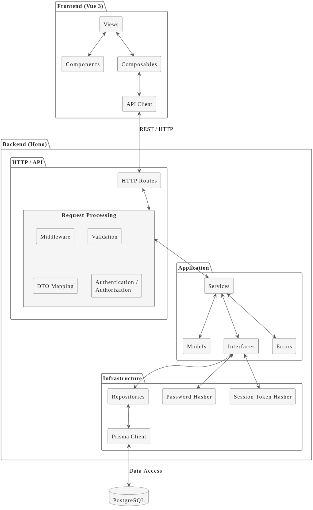

# Projekt in Kürze

Das Ticket-System entstand im Rahmen einer Praxisarbeit meiner Weiterbildung zum dipl. Informatiker HF mit Schwerpunkt Application Security. Ziel war es, den vollständigen Lebenszyklus einer modernen Fullstack-Webanwendung praktisch umzusetzen – von Anforderungsanalyse und Architektur über Frontend, Backend und Datenbank bis zu Security, Testing, CI/CD und Deployment.

Der funktionale Umfang wurde dafür bewusst minimal gehalten. Die Anwendung bietet einen Login sowie die grundlegende Verwaltung von Support-Tickets. Benutzer können Tickets erstellen und ihre eigenen Tickets verwalten, während Administratoren zusätzliche Funktionen zur Bearbeitung, Zuweisung und Statusverwaltung besitzen. Auf weiterführende Funktionen wie Registrierung, Kommentare, Dateianhänge oder Benachrichtigungen wurde bewusst verzichtet.

Im Mittelpunkt stand nicht die Entwicklung eines umfangreichen oder produktionsreifen Enterprise-Ticketing-Systems, sondern das praktische Verständnis dafür, wie die verschiedenen Bestandteile einer Fullstack-Anwendung von A bis Z zusammenspielen und sauber umgesetzt werden können.

> <a href="https://ticket-system.lucaknobel.ch/login" target="_blank" rel="noopener noreferrer">Ticket-System ausprobieren</a>

Für die Demo stehen vorkonfigurierte Benutzerkonten zur Verfügung:

| Rolle         | E-Mail                | Passwort             |
| ------------- | --------------------- | -------------------- |
| Administrator | `admin@example.com`   | `Admin!Ticket2026#`  |
| Benutzer      | `alice@example.com`   | `TicketSystem!2026#` |
| Benutzer      | `bob@example.com`     | `TicketSystem!2026#` |
| Benutzer      | `charlie@example.com` | `TicketSystem!2026#` |

# Architektur und Umsetzung

Das System folgt einer Client-Server-Architektur. Das Frontend wurde als Single Page Application mit Vue 3 und TypeScript umgesetzt und kommuniziert über eine REST-API mit einem eigenständigen Node.js-Backend auf Basis von Hono. PostgreSQL übernimmt die zentrale Persistenz.

Das Backend orientiert sich an den Prinzipien der Clean Architecture. HTTP-Verarbeitung, Anwendungslogik und technische Infrastruktur sind voneinander getrennt. Die Application-Schicht definiert ihre Abhängigkeiten über Interfaces, während konkrete Implementierungen wie Prisma-Repositories in der Infrastructure-Schicht liegen. Die Abhängigkeiten werden zentral über eine Composition Root zusammengesetzt.

Das Projekt ist als Monorepo mit getrennten Workspaces für Frontend, Backend und gemeinsam genutzte Verträge aufgebaut. Ein Shared-Paket stellt DTOs und Zod-Schemas bereit, wodurch Frontend und Backend dieselben API-Verträge, Typen und Validierungsregeln verwenden.

# Security und Qualitätssicherung

Authentifizierung und Autorisierung wurden serverseitig umgesetzt. Die Anwendung verwendet datenbankgestützte Sessions mit HttpOnly-Cookies, wobei nur Hashes der Session-Tokens gespeichert werden. Rollen und Besitzverhältnisse werden im Backend geprüft, sodass Benutzer nur zulässige Aktionen auf Tickets durchführen können.

Eingehende Daten werden mit Zod validiert und Passwörter mit Argon2 gehasht. Ergänzend kommen Security-Header und eine zentrale Fehlerbehandlung zum Einsatz.

Die Qualitätssicherung erfolgt auf mehreren Ebenen. Unit-Tests prüfen die Anwendungslogik isoliert, während Integrationstests das Zusammenspiel von REST-API, Persistenz und PostgreSQL überprüfen. Ergänzende Frontend-Tests decken zentrale Benutzerflüsse ab.

# CI/CD und Infrastruktur

Auch die Betriebsumgebung wurde im Rahmen des Projekts selbst aufgebaut. Die Anwendung läuft containerisiert auf einem eigenen Debian-VPS mit abgesichertem SSH-Zugang und Firewall. Docker bildet die Grundlage für den Betrieb, während Coolify die containerisierten Services verwaltet und bereitstellt.

GitHub Actions automatisiert den Build-, Test- und Deployment-Prozess. Änderungen durchlaufen Builds, automatisierte Tests, Type-Checking sowie verschiedene Sicherheitsprüfungen. Dazu gehören unter anderem Dependency Auditing, statische Codeanalyse mit Semgrep und Vulnerability-Scanning mit Trivy.

Bei Änderungen am Hauptbranch werden die betroffenen Container-Images automatisiert gebaut, geprüft, versioniert und in einer Container Registry veröffentlicht. Anschliessend wird das Deployment über Coolify ausgelöst.

# Erkenntnisse

Der wichtigste Lerngewinn des Projekts lag nicht in der Komplexität der Ticket-Funktionen, sondern im Zusammenspiel aller Bestandteile einer vollständigen Webanwendung.

Durch den bewusst begrenzten fachlichen Scope konnte ich mich stärker mit Softwarearchitektur, API-Design, Authentifizierung, Datenmodellierung, automatisierten Tests, Containerisierung, CI/CD und dem Betrieb auf eigener Infrastruktur auseinandersetzen.

Besonders wertvoll war der vollständige Weg von der lokalen Entwicklung über Frontend, Backend und Datenbank bis zu automatisierten Tests, Container-Images und dem laufenden Deployment. Neu waren für mich in dieser Kombination insbesondere Hono als Backend-Framework sowie das eigenständige Aufsetzen, Absichern und Betreiben einer containerisierten Anwendung auf einem VPS.

# Dokumentation

Die vollständige Projektdokumentation behandelt die Anforderungsanalyse, Systemkonzeption, Softwarearchitektur, Datenmodellierung, Implementierung, Security, Testing sowie CI/CD und Infrastruktur im Detail.

Bei Interesse an der vollständigen Dokumentation können Sie mich gerne über das [Kontaktformular](/de/contact) kontaktieren. Gerne stelle ich Ihnen die Arbeit auf Anfrage zur Verfügung.
